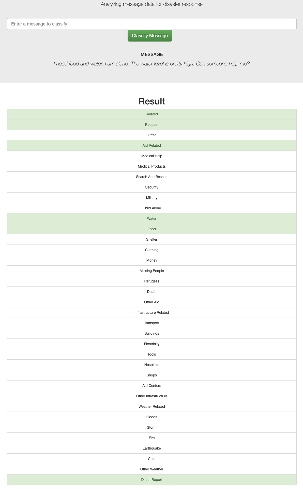

# Disaster Response Pipeline Project

Tested on python 3.9.12, sklearn 1.0.2.

And python 3.9.13, sklearn 1.1.3.


### Instructions:
1. Run the following commands in the project's root directory to set up your database and model.

    - To run ETL pipeline that cleans data and stores in database

        `python data/process_data.py disaster_messages.csv disaster_categories.csv DisasterResponse.db`
    - To run ML pipeline that trains classifier and saves

        `python models/train_classifier.py DisasterResponse.db classifier.pkl`

2. Go to `app` directory: `cd app`

3. Run your web app: `python run.py`

4. In the address bar in a browser type: `localhost:3000`

5. Click the `Disaster Response Project` button to open the homepage. Type in a query for message classification and click `Classify Message` button to see the classification results.

### Details of the files

The project directory looks like this:


```zsh
.
├── README.md
├── References.md
├── app
│   ├── run.py
│   └── templates
│       ├── example.png
│       ├── go.html
│       └── master.html
├── data
│   ├── DisasterResponse.db
│   ├── chat_acronyms_list.csv
│   ├── disaster_categories.csv
│   ├── disaster_messages.csv
│   └── process_data.py
├── models
│   ├── classifier.pkl
│   ├── clean_utils.py
│   ├── custom_classifier.py
│   ├── pipeline.py
│   ├── pipeline_utils.py
│   └── train_classifier.py
└── utils
    └── path_utils.py
```


1. In the root folder you will find:

  A. `data/` : this has the data pipeline and the data files

  B. `models/` : has the ML pipeline and the trained model is saved as *.pkl file

  C. `app/` : contains the web-app and the templates subdirectory (which in turn has html files for the app).

  D. `utils/`: has some path utilities to make sure that the different files play nice with each other.

2. The data is extracted by merging the `disaster_messages.csv` and `disaster_categories.csv` files. Duplicates are removed and incorrectly classified rows are removed. The resulting database is stored as a SQLite database `DisasterResponse.db`.

3. The ML pipeline loads the data from DisasterResponse.db and uses a custom classifier that handles multioutput binary classification.

4. The ML pipeline does some custom cleaning prior to feature generation:
        - URLSs are replaced by the string 'urlplaceholder'.
        - Repeated consecutive letters are reduced to a maximum of 2.
        - Spacy Lemmatization is performed.
        - Single letter words are removed.
        - Chat Abbreviations are translated to formal english.
        - Punctuations are removed.
        - Digits in the text are removed.

Then uses TFIDF to generate features. Another feature involving length of message is added as well.

5. The trained model is saved in `models/` folder.

6. After running the web-app, one can enter messages to see how the app performs. For example,

